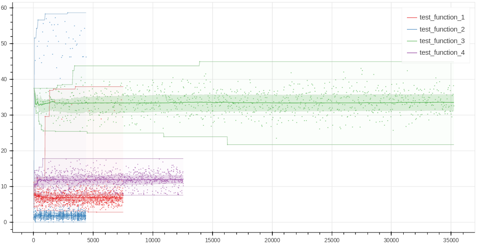

=======
perfume
=======

.. image:: https://img.shields.io/pypi/v/perfume-bench.svg
        :target: https://pypi.python.org/pypi/perfume-bench

.. image:: https://img.shields.io/travis/leifwalsh/perfume.svg
        :target: https://travis-ci.org/leifwalsh/perfume

.. image:: https://readthedocs.org/projects/perfume/badge/?version=latest
        :target: https://perfume.readthedocs.io/en/latest/?badge=latest
        :alt: Documentation Status

.. image:: https://pyup.io/repos/github/leifwalsh/perfume/shield.svg
        :target: https://pyup.io/repos/github/leifwalsh/perfume/
        :alt: Updates

Interactive performance benchmarking in Jupyter

* Free software: BSD license
* Documentation: https://perfume.readthedocs.io.

Overview
--------

`perfume` is a performance benchmarking tool that provides quick
feedback on the systems under test.

The primary goals are:

* Prioritize analysis of *distributions* of latency, not averages.
* Support both immediate feedback and robust benchmarking with many
  samples, through a UI that updates as we collect more information.
* Provide raw data back to the user, for flexible custom analysis.
* Provide helpful post-processing analysis and charting tools.

Features
--------

* Live-updating histogram chart and descriptive statistics during a
  benchmark run.
* Jupyter notebook integration.
* Tunable benchmarking overhead.
* Comparative analysis of multiple functions under test.
* Powerful post-processing analysis tools.

Demo
----

You can check out `an example notebook <docs/example.ipynb>`__ using
perfume.

.. image:: docs/perfume.gif

Installing
----------

.. code-block:: none

    pip install perfume-bench

Credits
-------

This package was created with Cookiecutter_ and the `audreyr/cookiecutter-pypackage`_ project template.

.. _Cookiecutter: https://github.com/audreyr/cookiecutter
.. _`audreyr/cookiecutter-pypackage`: https://github.com/audreyr/cookiecutter-pypackage

