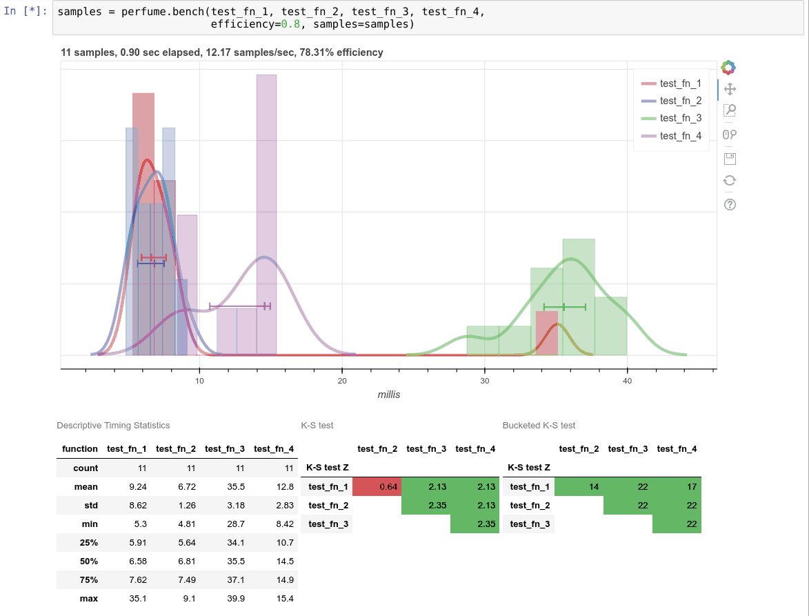

=====
Usage
=====

To use perfume in a project::

    import perfume
    # In a Jupyter notebook, you'll want these to get the plots to
    # display inline
    import bokeh.io
    bokeh.io.output_notebook()

Collecting samples
------------------

The entry point to :mod:`perfume` is :func:`perfume.bench`, which
takes a list of Python functions, and benchmarks them together.  It
will display, and update:

* A plot showing histograms of sampled latencies for each function,
  with a kernel density estimator and 25th, 50th, and 75th
  percentiles.
* A table of :meth:`pandas.DataFrame.describe` output for the sampled
  timings.
* Two pairwise Kolmogorov-Smirnov test tables, one on the raw samples,
  the other more sensitive to outliers (more on how later).

Analyzing results
-----------------

When you run :func:`perfume.bench`, it returns a
:class:`~pandas.DataFrame` of the samples, represented as wall-clock
``begin`` and ``end`` times.  There are several built-in ways to
interpret these, collected in :mod:`perfume.analyze`, a few examples
here:

* :func:`perfume.analyze.timings` interprets the ``begin``/``end``
  times in the samples :class:`~pandas.DataFrame` and computes the
  differences between ``end`` and ``begin``, giving you a new
  :class:`~DataFrame` containing elapsed time values.
* :func:`perfume.analyze.isolate` adjusts each function's
  ``begin``/``end`` times to be as if that function was benchmarked in
  isolation, so each ``begin`` matches the previous ``end``.  This can
  be interpreted as "time to simulated completion" of a given
  fixed-size workload.
* :func:`perfume.analyze.ks_test` runs the Kolmogorov-Smirnov test
  across the benchmarked functions (given output from
  :func:`perfume.analyze.timings`), giving pairwise results.  The
  2-sample K-S test is a measure of how different two distributions
  are (briefly, it's the largest vertical distance between their
  ECDFs).  For a function you think you've optimized, you can run the
  old and new versions and use the K-S test to get a sense for how
  likely it is that you've made a consistent improvement.
* :func:`perfume.analyze.cumulative_quantiles_plot` creates a plot
  over time of the median, upper and lower quantiles, and min and max,
  for all samples collected up until that point in simulation time.
  Each function is charted with its timings in isolation (see
  :func:`perfume.analyze.isolate`), so faster functions cover less of
  the x-axis.  For example:

  .. image:: cumulative_quantiles.png

See :mod:`perfume.analyze` for the full set of analysis tools.
